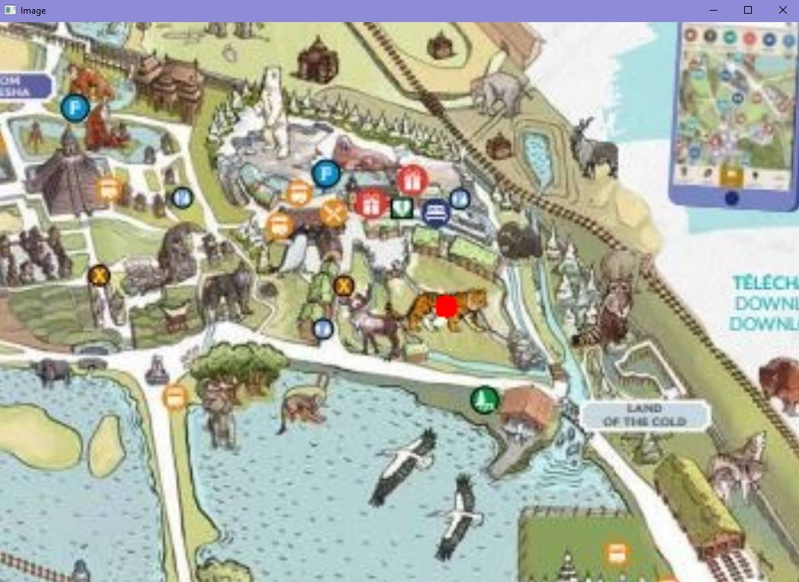
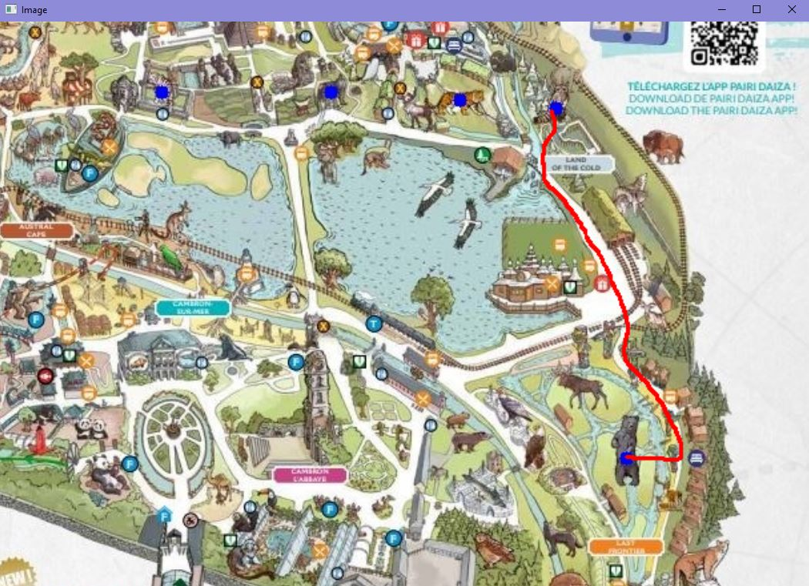

# Graphs

The idea of this project is to find the shortest way to see all the animals in a parc and come back to the entry at the end of the day. 

It's clearly a trading salesman problem but we would allow to get back to nodes we've already seen or edges (roads) we've already walked. 

The ultimate goal is to say : To see all the animals from the entry of the parc, you must see them in this order and you'll have to walk this much. 

The immediate upgrade of the problem could be adding some time constraints like queues in amusement parc like Disneyland,... or some PMR constraints for people that can't use stairs. We could even add some constraints telling that we must be at some points at some precise hour.  

The above and more general problem is to find the optimal walk on already existing edges to visit all the nodes at least once and come back to where we started. It has applications for buses, cars (Waze, maps), for planes (if we admit that the aerial traffic is already fixed) and more generally in all problems in which we wish to see all the nodes of a graph for a minimum total weight.

This will lead to the analysis of existing algorithms and upgrading of some of them hopefully. We can also explore the existing methods in packages like NetworkX or external software like concorde to see if some of them could be upgraded. It could also be useful to consider clustering method, assuming that if points are near, the distance between them can be minimized easily. It can also be good to explore combination algorithm to split the entire set of nodes in smaller sets of close nodes.

#--------------------------------------------------------------------------------------------------------------------------------------------------------------------------------------

Here's how the programm works : 

#--------------------------------------------------------------------------------------------------------------------------------------------------------------------------------------

There's a first section dedicated to creating by ourselves our graph based on scale map. It's called creating_the_data.ipynb
The idea is to get a scale map of our subject (a parc, a road map, ...) and add manually the points of interest and the paths linking them. 

When you run, a window with the map appear. On this image, you can do several actions using the key board but those keys may depend on your keyboard architecture. 

        - You can zoom and dezoom : It's '+' and '-' keys on my keyboard. 
        - You can move on the image : up = 'z', down = 'w', left = 'q', right = 's' 

The main action is to add points : you can do it by hitting the right-click on your pad or your mouse. When you do it, this happens : 

        - A window opens and asks the user to select a name for the node. In my application, those are animals. 
        - And when you validate, a red dot appears on the map. This point is however not saved yet. 

As it may not be suitable to add all points at once, you can do it in multiple steps : 

        - When you want to save the red points you added, press 'p'. 
        - A new window opens and the red points became blue, meaning that they've been saved. 

You can do it as many times as you want. 

        - When you finished adding all points, press 'y' and the window closes. 

It's now time to add the paths between the points we added. 

        - You have to maintain the left-click pushed while drawing the path between the 2 nodes you want to link. 

When it's done, a new window opens and you must choose the 2 ends of the path among the points you added previously and validate your answer.
The order in which you link the points doesn't matter.  
If you misclick, just press cancel and the curve won't be kept. 

Then just move or zoom on the image to see the curve drawn in red. 

You can add multiple paths between the same 2 nodes. Only the shortest one will be kept for computations. 

Drawing a path linking the node to hitself is kinda weird in this application because this will never be used in the optimal path. 

Once again, press 'p' to save the current curves in red (and they become blue) and 'y' when you finished addind paths. 

We have some created files : 

        - points.txt : the added points with their positions 
        - curves.txt : the added curves (the number of the curve and the 2 ends) with their length 

        - Map_with_points.JPG : the map with the added points
        - Map_with_curves.JPG : the map with the added curves

And it also prints the points and curves in the notebook. 

#--------------------------------------------------------------------------------------------------------------------------------------------------------------------------------------

The second section is about trying to find the shortest paths using known algorithms. it's called sol_google.ipynb

#--------------------------------------------------------------------------------------------------------------------------------------------------------------------------------------

First, you see a distance matrix between the nodes. 
The i,j entry of this matrix is the shortest distance between nodes i and j. If there's no edge between the nodes, the entry should be infinity. In practise, the algorithm needs integer values and so it's 10**15.

#--------------------------------------------------------------------------------------------------------------------------------------------------------------------------------------

You then see the result of the kruskal algorithm.It's computed using the defined functions in NetworkX.
The result is the cheapest spanning tree linking all nodes of the graph. It's saved in kruskal.pdf

#--------------------------------------------------------------------------------------------------------------------------------------------------------------------------------------

You then have the algorithm from Google that computes the optimal path 

It then displays the optimal path : on the left with respect to the position of the points on the map and on the right with automatically adjusted positions
What you can observe is that sometimes, the algorithm selects 10**15 edges (that don't really exist) and so, the result is not really a cycle. 

